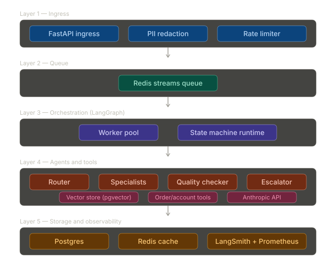

# Triage: Multi-Agent Customer Support System

A production-style customer support automation system built with LangGraph and the Anthropic API. Incoming tickets are classified, routed to specialized agents that retrieve relevant policy documents and call live tools, reviewed by a quality gate, and escalated to humans when confidence is low.

Designed for 5,000 tickets/day. Evaluated against 500 simulated tickets with end-to-end metrics.

---

## How it works



Each Specialist (Claude Sonnet) retrieves relevant policy and FAQ documents via pgvector, then calls tools to look up real order or account data before generating a response. The Quality Checker (Claude Haiku) scores the response and blocks it if it fails hard rules or an LLM-as-judge threshold. The Escalator handles graceful handoff when the system isn't confident.

---

## Stack

| Layer | Technology |
|---|---|
| Agent orchestration | LangGraph |
| LLM | Anthropic API (Haiku + Sonnet) |
| Vector search | pgvector on Postgres |
| Embeddings | Voyage AI |
| Queue | Redis Streams |
| API | FastAPI (async) |
| Observability | LangSmith + Prometheus |
| Demo UI | Streamlit |
| Deployment | Modal / Railway |

---

## Project layout

```
src/triage/
├── agents/
│   ├── router.py           # Classifies ticket intent
│   ├── specialists/        # One agent per intent category
│   ├── quality_checker.py  # LLM-as-judge + rule-based gate
│   └── escalator.py        # Human handoff logic
├── graph/
│   ├── state.py            # Shared LangGraph state definition
│   └── builder.py          # Wires nodes, edges, and conditions
├── retrieval/              # Embedding + pgvector retrieval
├── tools/                  # Order lookup, account status
├── api/                    # FastAPI ingress
├── queue/                  # Redis Streams producer/consumer
├── db/                     # SQLAlchemy models + Alembic migrations
├── observability/          # LangSmith setup, Prometheus metrics
└── config.py               # Pydantic Settings, env-driven
tests/
├── unit/                   # Fast, no external deps
├── integration/            # Hits real DB/Redis
└── eval/                   # 500-case evaluation harness
scripts/
├── hello_claude.py         # API smoke test
└── ingest_docs.py          # Chunk and embed knowledge base
demo/
└── app.py                  # Streamlit demo UI
```

---

## Evaluation results

> Results will be added after the evaluation suite runs.

| Metric | Target | Actual |
|---|---|---|
| Tickets evaluated | 500 | TBD |
| Resolution accuracy | >85% | TBD |
| p95 latency | <8s | TBD |
| Cost per ticket | <$0.05 | TBD |
| Escalation rate | 10-15% | TBD |
| QC rejection rate | meaningful | TBD |

---

## Running locally

**Requirements:** Python 3.13, Docker Desktop.

```bash
# 1. Start infrastructure (Postgres on 5433, Redis on 6379)
docker compose -f docker/docker-compose.yml up -d

# 2. Install
python -m venv .venv && source .venv/bin/activate
pip install -e ".[dev]"
pre-commit install

# 3. Configure
cp .env.example .env
# Fill in ANTHROPIC_API_KEY, VOYAGE_API_KEY, LANGCHAIN_API_KEY

# 4. Apply database migrations
alembic upgrade head

# 5. Ingest knowledge base into pgvector
python scripts/ingest_docs.py

# 6. Smoke test
python scripts/hello_claude.py
```

> **Voyage AI free tier:** the ingestion script sleeps 21 seconds between files to respect the 3 RPM limit. Add a payment method at dash.voyageai.com/billing to unlock higher limits (200M free tokens still apply).

---

## Architecture decisions

**Why LangGraph over plain function calls?** Explicit state and conditional edges make the routing logic auditable. When a Quality Checker rejects a response, the retry path is a declared edge in the graph, not a hidden loop inside a function.

**Why separate Specialists instead of one general agent?** Different intent categories have different retrieval corpora, different tool sets, and different prompt constraints. Separating them keeps each agent's prompt tight and lets us measure per-category accuracy independently.

**Why Haiku for Router and Quality Checker?** Classification and rule-checking don't need Sonnet-level reasoning. Running Haiku at the bookends cuts cost significantly while keeping the expensive Sonnet calls focused on the actual response generation.

**Why pgvector over a managed vector DB?** At ~10k documents and one team, operating a separate vector service adds complexity without benefit. pgvector runs in the same Postgres instance as the rest of the application state. Migration path to Pinecone or Weaviate is documented if the doc count grows.

**Why async ingress?** LLM calls take 3-8 seconds. Holding an HTTP connection open for that duration at scale is a problem. The API accepts a ticket and returns a `ticket_id` immediately; the client polls or receives a webhook when processing completes.
