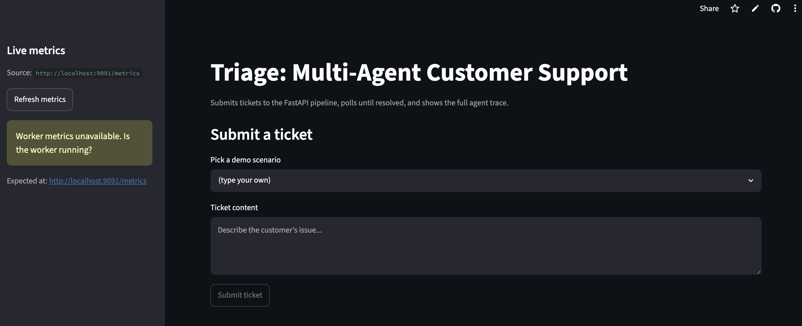
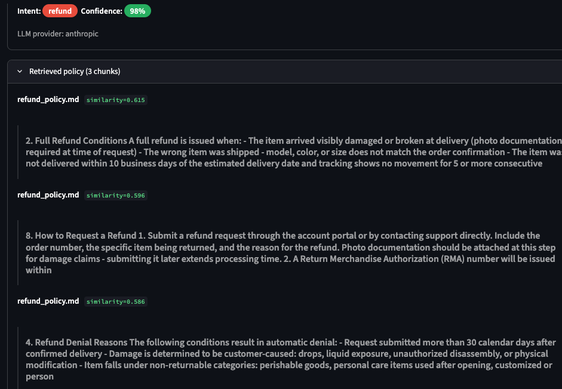
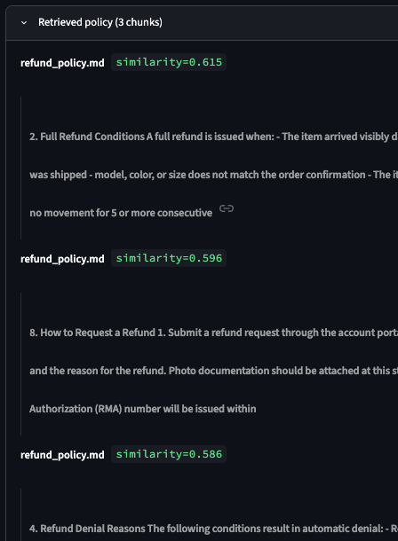
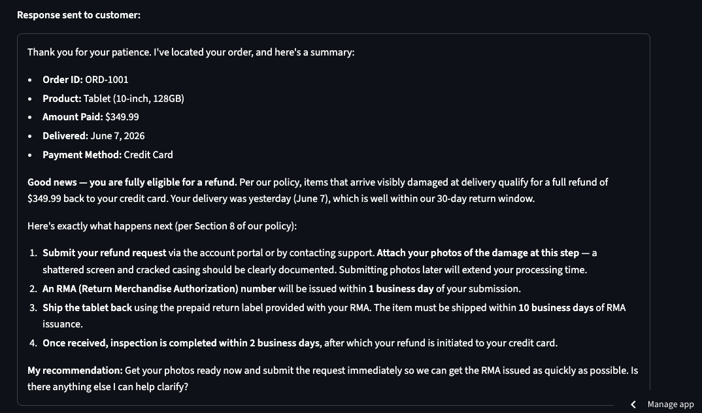
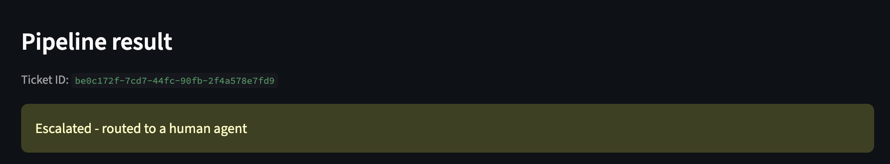
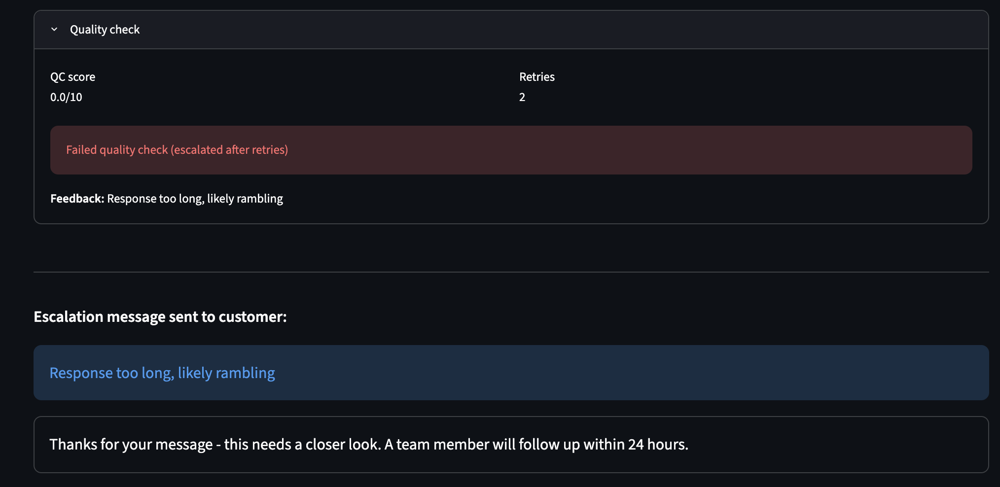
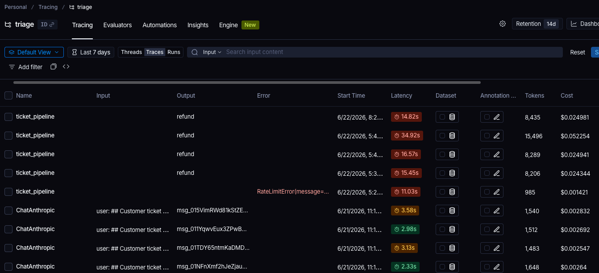
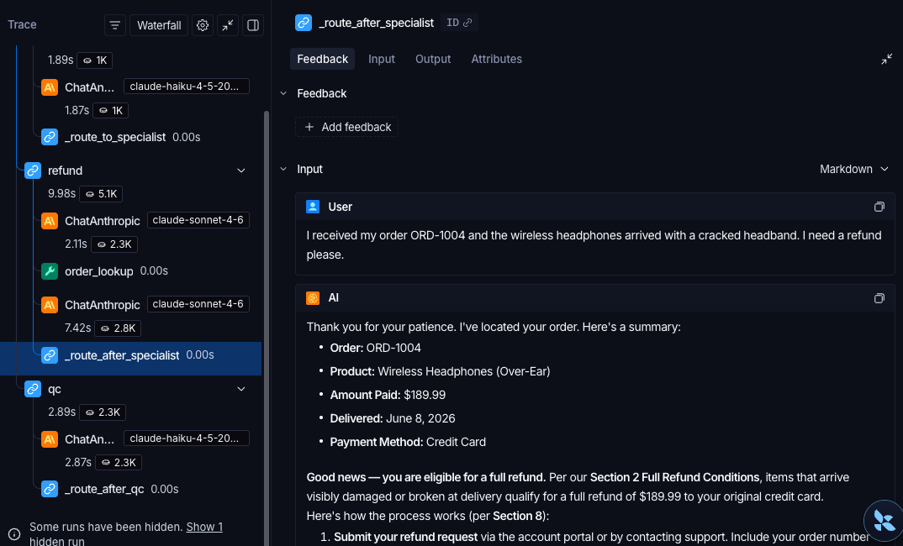
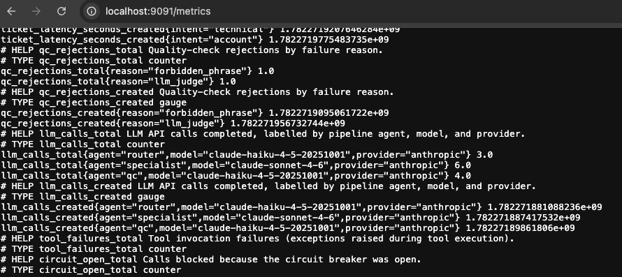

# Triage

A multi-agent customer support automation system. Multi-agent routing, RAG-grounded responses, quality verification, graceful escalation, with full observability.

[](https://www.python.org/downloads/)
[](https://github.com/langchain-ai/langgraph)
[](LICENSE)
[](tests/eval/datasets/tickets_500.json)

**[Live demo](https://triagedemo.streamlit.app)**

---



---

## Headline metrics

Evaluated against the first 50 tickets of a 500-case synthetic dataset. Full trajectory, root-cause analysis, and run-to-run variance notes: [`tests/eval/results/baseline_numbers.md`](tests/eval/results/baseline_numbers.md).

| Metric | Value |
|---|---|
| Resolution accuracy | 68.8% across 50 evaluated cases |
| Intent classification accuracy | 100% |
| P95 latency | 57.5s |
| Cost per resolved ticket | $0.056 |
| Escalation accuracy | 85.7% |
| QC rejection rate | 46% |

The 70% resolution target was not reliably crossed. The best single run was 68.8%; the average across 12 real-mode runs is approximately 57%. The 22-point swing between best (68.8%) and worst (46.2%) is driven by LLM temperature variance in the specialist: the same ticket produces a different response each run, which determines whether QC passes, which determines whether a retry fires. This is the real behavior of a prompt-based v1 pipeline and is reported here as-is, not averaged away.

---

## Architecture


Incoming tickets enter via a FastAPI ingress that immediately returns a `ticket_id` and enqueues the work to a Redis Streams queue. A worker process subscribes to that queue and drives each ticket through the LangGraph pipeline: Router classifies intent, a Specialist retrieves policy and calls live tools, the Quality Checker runs a two-stage gate, and the Escalator generates a structured handoff if confidence is too low or quality too poor. The full trace is recorded in LangSmith; custom counters are exposed on a Prometheus endpoint.

### Stack

| Layer | Technology |
|---|---|
| Agent orchestration | LangGraph |
| LLM | Anthropic API (Haiku for router/QC, Sonnet for specialists) |
| Vector search | pgvector on Postgres |
| Embeddings | Voyage AI |
| Queue | Redis Streams |
| API | FastAPI (async) |
| Observability | LangSmith tracing + Prometheus metrics |
| Demo UI | Streamlit |
| Deployment | Modal (serverless, sync mode) |

---

## How it works

- The **Router** (Haiku, forced `tool_choice`) classifies the ticket into one of four intent categories with a confidence score. Confidence below 0.6 short-circuits directly to escalation without running a specialist.
- The **Specialist** (Sonnet) runs an agentic loop: embed the ticket, retrieve the top-5 policy chunks by cosine similarity from pgvector, call live tools (`order_lookup`, `account_status`) as needed, then generate a draft response grounded in retrieved context.
- The **Quality Checker** runs three gates in sequence. Stage 1 blocks on hard rules (PII patterns, length bounds, four forbidden phrases, low router confidence). Stage 1.5 runs a deterministic compliance checklist for refund responses, verifying all required Section 8 disclosures are present before the LLM judge sees the draft. Stage 2 runs a Haiku-as-judge prompt and blocks drafts scoring below 7.0/10.
- Rejected drafts are returned to the Specialist with specific feedback. The retry cap is 2; a second rejection escalates.
- The **Escalator** (Haiku) generates a structured `EscalationSummary` with intent, confidence, the rejection reason, and a recommended action for the human agent.
- Every LLM call and pipeline transition is traced in LangSmith as a child span under a `ticket_pipeline` root. Six custom Prometheus counters track throughput, latency, QC rejections, LLM call volume, tool failures, and circuit-breaker events.

---

## Resolved ticket

The full agent trace is accessible in the Streamlit demo after each ticket resolves. Expand the collapsibles to see the routing decision, retrieved policy chunks with similarity scores, tool call results, QC gate outcomes, and the final response.







---

## Escalation path

Ambiguous or low-confidence tickets skip the specialist and escalate with a structured reason. The QC retry cap also triggers escalation when the specialist cannot produce a passing draft after two attempts.





---

## Architecture decisions

**LangGraph over CrewAI or a plain function chain.** LangGraph gives explicit state and declared conditional edges. When QC rejects a draft, the retry path is a named edge in the graph definition, not a hidden loop inside a function body. That makes the control flow auditable and the state inspectable at every node.

**Hierarchical multi-agent over sequential or parallel.** Each intent category has a different retrieval corpus, a different tool set, and different prompt constraints. Merging them into one agent inflates the context window and makes per-category accuracy invisible. Parallelizing them would generate multiple draft responses for the same ticket, which is wasteful before intent is known. The correct decomposition is: classify first, then run the right specialist.

**pgvector over Pinecone or Weaviate at this scale.** The knowledge base is roughly 10,000 document chunks. Operating a separate vector service adds infrastructure cost and a network hop for a collection that fits comfortably in the same Postgres instance used for ticket state. The migration path to a dedicated vector store is documented in the retriever if document volume grows.

**Two-stage QC rather than a single LLM judge.** Hard rules (PII, length, forbidden phrases) are deterministic and cost zero tokens, so they run first. The LLM judge only runs when the draft passes those checks. Stage 1.5 sits between them for legally-required disclosures: checking programmatically whether "RMA issued within 1 business day" appears in the response is cheaper, faster, and more reliable than asking Haiku to verify it.

**Haiku for Router and QC, Sonnet for Specialists.** Intent classification and rule-checking do not require deep reasoning; Haiku handles both at roughly one-tenth the token cost. The specialist's job is to synthesize retrieved policy, tool output, and conversational context into a compliant customer response, which benefits from the stronger model.

**Async ingress with a queue in local deployment; sync mode in the serverless demo.** Holding an HTTP connection open for 8-15 seconds at scale causes client timeouts and server thread exhaustion. The local stack enqueues tickets to Redis Streams and returns immediately, with the worker polling asynchronously. The Modal deployment has no persistent worker process, so `SYNC_MODE=true` runs the graph inline via `asyncio.to_thread()`. Both paths share the same pipeline code; the difference is only in where the blocking call happens.

**ivfflat over hnsw for the vector index.** At 10,000 vectors, hnsw's build time and memory overhead are not justified. ivfflat with `lists=100` provides accurate approximate nearest-neighbor search with a build cost that fits in a one-time ingestion script and a query latency that is not measurable relative to the LLM call that follows it. This can be revisited if the knowledge base grows to hundreds of thousands of chunks.

**Structured tool-use output for the Router over text parsing.** `tool_choice={"type": "tool", "name": "classify_ticket"}` forces exactly one tool call with a Pydantic-validated schema. There is no free-text fallback and no regex extraction. If the model returns a value outside the four valid categories, the router catches the `ValidationError` and escalates the ticket rather than propagating a bad state through the pipeline.

**Similarity threshold of 0.50 for retrieval filtering.** The threshold was set by inspecting the score distribution across 50 eval tickets. Scores above 0.50 consistently returned on-topic chunks; scores below 0.45 were irrelevant policy sections from the wrong category. The threshold is conservative by design: false negatives (missing a relevant chunk) are worse than false positives (including a marginally relevant one), because the LLM ignores irrelevant context but cannot invent missing policy.

---

## Observability

Every ticket run is a trace in LangSmith. The root span is `ticket_pipeline`. Under it sit `router`, `specialist` (with retrieval and each tool call as children), `quality_checker` (with Stage 1, Stage 1.5, and Stage 2 as sub-spans), and `escalator` if it fires. The specialist's intermediate iterations are also traced, so you can see the model's tool request and the tool's response side by side.





The Prometheus endpoint at `/metrics` on the worker process exposes six custom counters: `tickets_total` (labelled by intent and status), `ticket_latency_seconds` (histogram, by intent), `qc_rejections_total` (by rejection reason), `llm_calls_total` (by agent, model, and provider), `tool_failures_total` (by tool name), and `circuit_open_total` (by tool name). These are independent of LangSmith and can be scraped by any Prometheus-compatible collector.



---

## Failure modes

| Failure | System response |
|---|---|
| Router confidence below 0.6 | Specialist is skipped; ticket escalates immediately with confidence score attached |
| Router returns invalid intent (very ambiguous ticket) | `ValidationError` is caught; ticket escalates with reason "Router could not determine intent" |
| QC Stage 1 hard rule violation (PII, length, forbidden phrase) | Draft rejected; retry count incremented; rejection reason prepended to specialist context |
| QC Stage 2 score below 7.0 | Draft rejected; targeted LLM feedback sent to specialist for retry |
| Max retries (2) exceeded | Ticket escalates with the last rejection reason and all retry attempts recorded |
| Tool circuit breaker open (5 failures in 60s) | Model receives explicit "service unavailable" message; answers from retrieved policy only |
| Anthropic API 5xx or timeout | Cross-provider fallback to OpenAI `gpt-4o-mini`; `provider` field in state records which backend ran |

---

## Run it locally

```bash
git clone https://github.com/snehpillai/triage.git && cd triage
cp .env.example .env  # fill in ANTHROPIC_API_KEY, VOYAGE_API_KEY, LANGCHAIN_API_KEY
docker compose -f docker/docker-compose.yml up
```

On first run, migrate the database and ingest the knowledge base (one-time):

```bash
docker compose -f docker/docker-compose.yml exec api alembic upgrade head
docker compose -f docker/docker-compose.yml exec api python scripts/ingest_docs.py
```

Demo UI at `http://localhost:8501`. API at `http://localhost:8000`. Worker metrics at `http://localhost:9091/metrics`.

---

## Run the eval

```bash
echo "y" | PYTHONPATH=src python tests/eval/harness.py --mode real --workers 1 --max 50
```

Runs 50 tickets through the full pipeline with a Haiku judge. Estimated cost: $2.50-$3.50. Estimated time: 25-35 minutes at `--workers 1`. Use `--mode fast` for a zero-cost deterministic smoke test (keyword mock + MD5 judge, completes in under 5 seconds).

---

## Repo layout

```
src/triage/
├── agents/
│   ├── router.py           # Intent classification (Haiku, forced tool_choice)
│   ├── specialists/base.py # Agentic loop: retrieval, tool calls, cross-provider fallback
│   ├── quality_checker.py  # Stage 1 hard rules + Stage 1.5 compliance + Stage 2 LLM judge
│   └── escalator.py        # Structured escalation summary
├── graph/
│   ├── state.py            # Shared LangGraph state
│   └── builder.py          # Nodes, edges, retry cycle, confidence guard
├── retrieval/              # Voyage AI embeddings + pgvector similarity search
├── tools/
│   ├── order_lookup.py
│   ├── account_status.py
│   └── circuit_breaker.py  # Redis-backed per-tool circuit breaker
├── api/                    # FastAPI ingress, ticket status polling
├── queue/                  # Redis Streams producer and consumer
├── db/                     # SQLAlchemy models, Alembic migrations
├── observability/          # LangSmith setup, Prometheus metric definitions
└── config.py               # Pydantic Settings, env-driven
tests/
├── unit/                   # 124 tests, no external dependencies, under 2 seconds
├── integration/            # Real API and database, gated behind -m integration
└── eval/                   # 500-case harness with fast and real modes
```

---

## What's next

Given more time, these are the areas worth investing in, roughly in priority order.

**Structured specialist output.** The biggest source of eval variance is the specialist's free-text response missing a required disclosure on some runs. Switching to structured output with mandatory fields (`eligibility`, `policy_section`, `process_steps`, `payment_method`) would make required disclosures schema constraints rather than prompt suggestions, eliminating the Stage 1.5 retry loop for the common case.

**Grafana dashboard on the Prometheus endpoint.** The metrics exist and are being scraped; what's missing is a visualization layer. A dashboard showing tickets per minute, escalation rate over time, per-intent QC rejection breakdown, and circuit breaker events would make the system's runtime behavior visible without opening LangSmith.

**Prompt versioning and A/B testing.** The specialist prompt changed nine times during evaluation development. There is currently no way to run two prompt variants against the same dataset slice simultaneously or to roll back to a previous version by name. Adding a prompt registry keyed on (agent, version, eval score) would make the improvement trajectory auditable and reversible.

**Semantic response caching.** For a real support queue, many tickets are slight variations of the same scenario ("my order arrived damaged" in a hundred different phrasings). Caching specialist responses keyed on (intent, top retrieved chunk IDs, order facts) would eliminate redundant LLM calls for common scenarios, cut cost significantly, and remove run-to-run variance for the cached cases.

**Integration with a real ticketing system.** The current system is self-contained. A Zendesk or Intercom webhook adapter would let it operate as a first-pass automation layer in a real support queue, with the escalation path writing back to the source system instead of a local database record.
